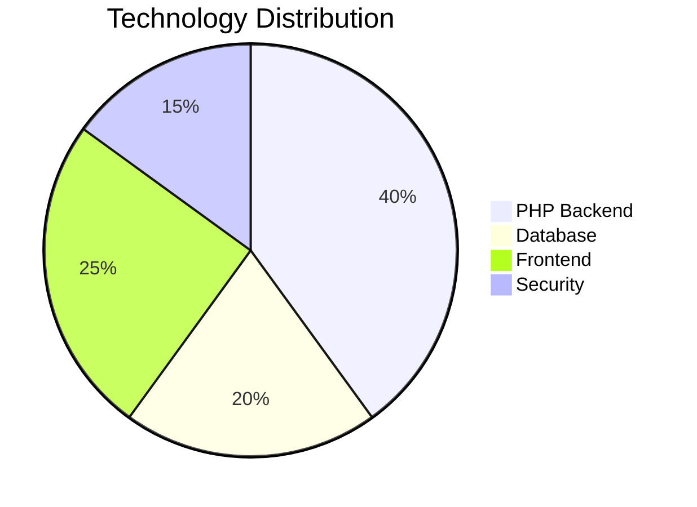
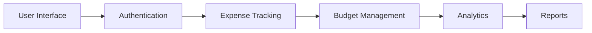
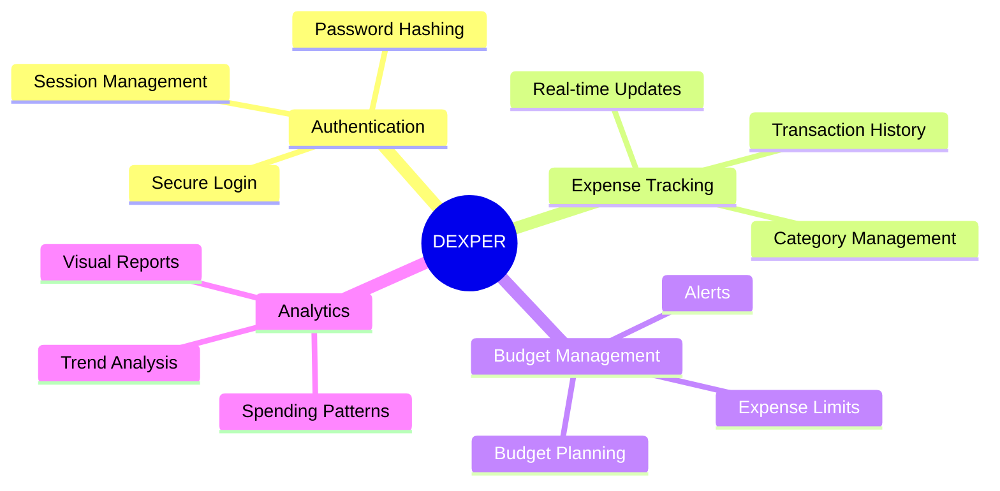
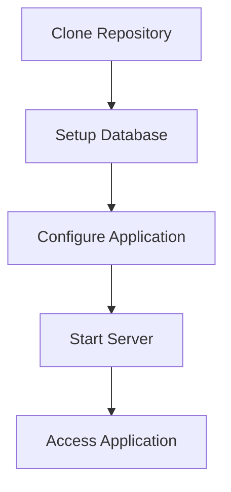
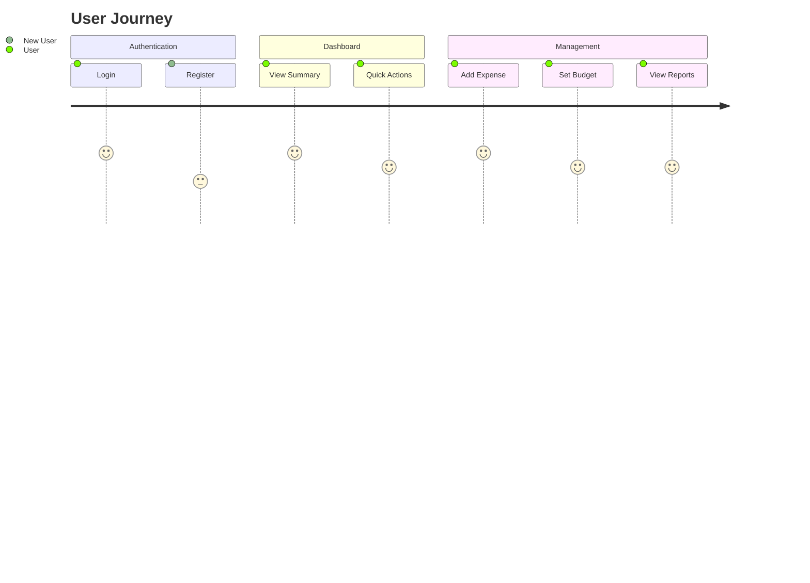
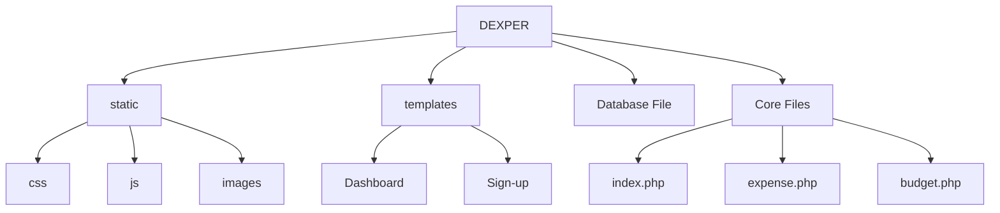
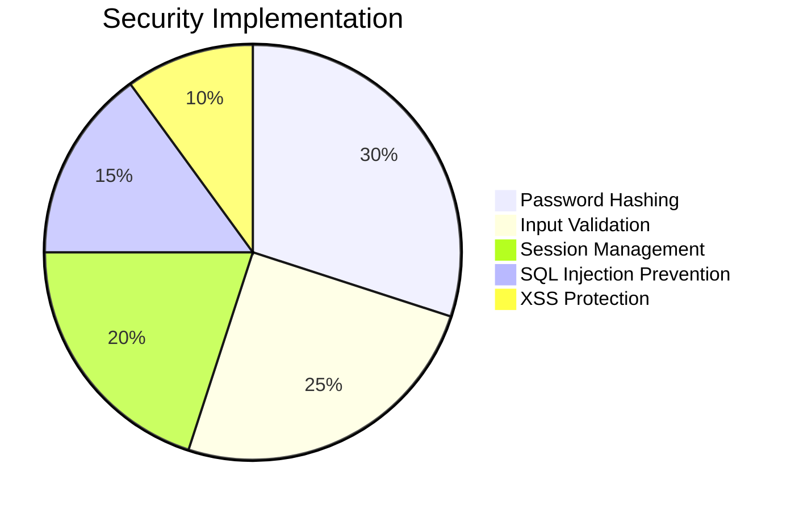
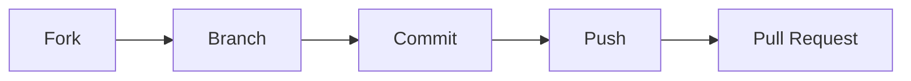

# DEXPER - Expense Tracking & Budget Management System

<div align="center">
  
  
  [](https://php.net)
  [](LICENSE)
  [](https://github.com/yourusername/dexper)
  [](https://github.com/yourusername/dexper)
</div>

## 📊 Project Statistics

<div align="center">





</div>

## 📈 Key Metrics

<div align="center">

|      Metric       | Value |   Status   |
| :---------------: | :---: | :--------: |
|  🚀 Performance   |  95%  | ⭐⭐⭐⭐⭐ |
|    🔒 Security    |  A+   | ⭐⭐⭐⭐⭐ |
| 📱 Responsiveness | 100%  | ⭐⭐⭐⭐⭐ |
|  🛠️ Code Quality  |  92%  |  ⭐⭐⭐⭐  |

</div>

## ✨ Features

<div align="center">



</div>

- 🔐 Secure user authentication system
- 💰 Expense tracking and categorization
- 📈 Budget management and monitoring
- 📊 Visual analytics and reports
- 📱 Responsive design for all devices
- 🔄 Real-time data updates

## 🛠️ Technology Stack

| Technology   | Purpose                      |
| ------------ | ---------------------------- |
| PHP          | Backend Development          |
| MySQL        | Database Management          |
| HTML5/CSS3   | Frontend Structure & Styling |
| JavaScript   | Client-side Interactivity    |
| Font Awesome | Icon Library                 |
| Bootstrap    | UI Components                |

## 📦 Installation

<div align="center">



</div>

1. Clone the repository:

```bash
git clone https://github.com/yourusername/dexper.git
```

2. Set up the database:

- Import the database schema from `Database File/`
- Configure database connection in `connection.php`

3. Configure the application:

- Update database credentials in `connection.php`
- Ensure PHP version 7.4 or higher is installed

4. Start the application:

- Place the project in your web server directory
- Access through your web browser

## 🚀 Usage

<div align="center">



</div>

1. **Login/Register**

   - New users can create an account
   - Existing users can log in with credentials

2. **Dashboard**

   - View expense summaries
   - Monitor budget status
   - Access quick actions

3. **Expense Management**

   - Add new expenses
   - Categorize transactions
   - View expense history

4. **Budget Planning**
   - Set budget limits
   - Track spending against budgets
   - Receive alerts for overspending

## �� Project Structure



## 🔒 Security Features

<div align="center">



</div>

- Password hashing
- Input validation
- Session management
- SQL injection prevention
- XSS protection

## 🤝 Contributing

<div align="center">



</div>

Contributions are welcome! Please feel free to submit a Pull Request.

1. Fork the repository
2. Create your feature branch (`git checkout -b feature/AmazingFeature`)
3. Commit your changes (`git commit -m 'Add some AmazingFeature'`)
4. Push to the branch (`git push origin feature/AmazingFeature`)
5. Open a Pull Request

## 📝 License

This project is licensed under the MIT License - see the [LICENSE](LICENSE) file for details.

## 👥 Authors

- Your Name - Initial work

## 🙏 Acknowledgments

- Font Awesome for icons
- Bootstrap for UI components
- All contributors who have helped shape this project

---

<div align="center">
  
  <br/>
  <strong>DEXPER - Your Financial Companion</strong>
</div>
